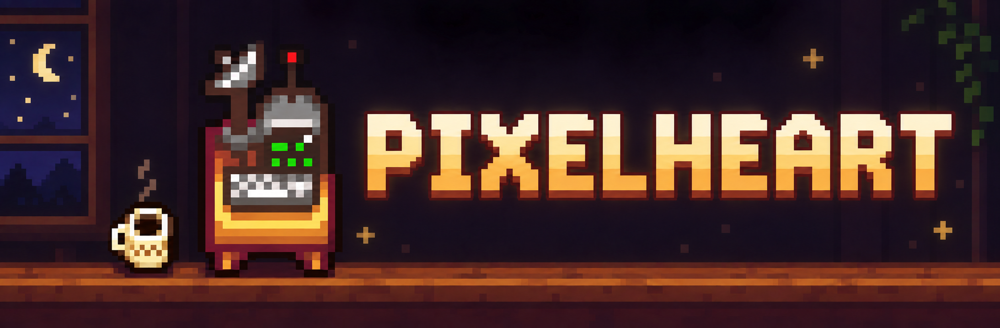

# Pixelheart

An experimental desktop editor for creating custom **Stardew Valley** NPCs. Write dialogue and schedules, build story scenes and supporting cast, add artwork and maps, and export Content Patcher packs.



> [!CAUTION]
> **This project is still at an early stage and started 2 AM; the GUI is currently terrible. Clone at your own peril.**

Projects stay on your computer. Use artwork you have permission to use. Packaged releases and full in-game verification are still pending.

## Run from source

Install [uv](https://docs.astral.sh/uv/getting-started/installation/) **0.12.16+**, then run from the repository root:

```sh
uv sync --locked
uv run --locked python -m pixelheart
```

uv manages Python and dependencies. Exported packs target Stardew Valley 1.6 with SMAPI and Content Patcher; see the [export guide](EXPORT_FORMAT.md) for supported features and required dependencies.

## Create your first mod

<details>
<summary>From a character idea to a playable mod</summary>

Start in **Create your mod**. This is the place to build a first playable chapter,
then return to expand the same character, supporting cast and relationships.
The other sidebar pages are the editors for the actual content in your project.

### 1. Make an editable story framework

Write the character's name and concept, then choose a story framework:

- **Guarded protector:** accepting help, repairing broken trust, and building a home.
- **Wandering artist:** finishing imperfect work, sharing it, and choosing somewhere to belong.
- **Gentle healer:** accepting care, setting boundaries, and building a reciprocal relationship.

Describe what the character wants, their difficulty getting close, and why they
arrive. Choose romance or friendship. Add a supporting character's name if the
story needs someone who arrives with them.

Click **Preview my story**. Read the actual identity, weekday conversations,
gifts, routine, scenes, player responses, everyday-life rules and supporting
character before applying them. The writing is an original, offline framework.
Your free-form concept stays in the brief and biography as direction for your
rewriting; it isn't automatically interpreted by an AI.

Applying the preview creates:

- An introduction and seven weekday conversations.
- Gift preferences and a four-stop basic routine.
- A zero-heart meeting followed by chapters at 2, 4, 6 and 8 hearts.
- For romance, additional chapters at 10, 12 and 14 hearts. The 10-heart chapter
  requires dating; the 12- and 14-heart chapters require marriage.
- A cast, complete dialogue, narration and a closing two-answer player choice
  for each chapter. Each answer has its own NPC response and friendship effect.
- Seasonal and rainy-day conversations, and authored spouse conversations for
  romance. Post-chapter conversations and seasonal/rain/married routines are
  drafts to review and enable in **Life & reactions**.
- If requested, a separate supporting character with their own identity,
  introduction, weekdays, gifts and routine, plus a cameo in the first scene.
  A new supporting character starts as an adult, nonromanceable character; its
  age and other details can be edited in **Cast & locations**.

Existing authored entries stay in place. Applying the same framework again
preserves edits and stable chapter identities. A fresh preview can restore a
missing generated chapter. It does not rewrite existing chapters to match a new
framework. A preview becomes invalid if the project changes before it is applied.

### 2. Finish one chapter before expanding

Open **Make it playable** and select the zero-heart meeting. Use **Write this
chapter** to review the setup and dialogue, then **Rehearse this chapter** to
inspect its sequence and readiness checks.

Make the scene your own. Replace the framework's props, tensions and dialogue
with the details that matter to this character. A useful scene gives the player
something to notice, something to respond to, and a change they can understand.
The final choice can make the NPC respond differently and award a different
friendship amount. The current choice editor supports two closing responses;
it is not an unrestricted branching quest engine.

Check the location, time window and actor positions. The actor picker includes
your supporting cast, and the map pickers include places from this project. The
staging preview can show your imported map underneath the actors. The initial framework uses
the character's home map and tile. The basic routine also begins with stops at
that tile so no route is silently invented. Choose destinations in the schedule
editor, and check that every tile and connecting route works in the intended
save. A placement preview is a staging aid, not a collision or pathfinding test.

When the scene is ready for export, **mark it ready**. Generated chapters begin
as scene drafts. Later chapters can stay drafts while you export and play the
first meeting. Ready chapters require their prerequisites to be ready too.

### 3. Supply the artwork

Save the project, then open **Artwork** to import the main character's portrait
and sprite sheets. **From my game…** imports Abigail/Elliott references from
your local Content Patcher exports; Dialogue can load their complete exported
dialogue file too. Follow the commands in each dialog, or see the
[local import guide](ARTWORK.md#templates-from-your-game). Use the frame browser to check the layout. The export requires real local PNG sheets; a UI portrait preview is not
an exportable game sheet.

Base dimensions:

| Sheet | Required layout |
| --- | --- |
| Portrait | 128 pixels wide, at least 192 high, in 64-pixel rows |
| Nonromance sprite | 64 pixels wide, at least 128 high, in 32-pixel rows |
| Romance sprite | 64 pixels wide, at least 416 high, including kiss/wedding frames |

Supporting characters need their **own** portrait and sprite in **Cast &
locations**. Missing sheets block export. Image dimensions can be checked by the
app; the meaning and quality of each expression or animation need visual review
and an in-game check. Optional seasonal and beach art is available in Artwork.

### 4. Let the story affect daily life

Open **Life & reactions** to edit situation-based conversations, routines and
spouse dialogue. Choose situations using the controls: season, weather, weekday,
minimum hearts, relationship state, completed chapter, or farmhouse upgrade.

For example, after reviewing the 4-heart conflict chapter, edit its generated
follow-up conversation to show what the character learned. Mark the chapter
ready, then enable the conversation. The player will hear it only after seeing
that chapter. Later matching rules override earlier matching rules, so put the
most specific situation later in the list.

Review the generated seasonal and rainy-day routes, choose suitable destinations,
and enable them. The initial draft copies the basic route; it does not guess
indoor shelters or walkable destinations. Married routes should finish with
**Return to farmhouse**, which uses the game's bed destination. Routine and
conversation conditions are selected at the start of a day: sleep once before
checking a changed situation or the full route.

Spouse dialogue has morning, rainy-morning, evening and rainy-evening moments.
Review each line as part of the character's life after marriage. A 14-heart scene
alone does not cover the everyday experience of living with the character.

### 5. Expand the cast and places

Use **Cast & locations** for supporting characters, supplied custom locations,
spouse rooms and required mod dependencies. Supporting characters have their own
editable content and are packaged with the main character. Use them in a scene's
cast when the story involves them.

Use **Assign & design home…** in Identity, a companion's profile, or the creator
journey to choose where a character lives. Place them visually on a supplied
map, choose their facing, and optionally move route stops from their old home
tile. Create a **12×12 home interior** with your own tilesheet, or import a Tiled
home, then connect its entrance and exit. See the
[home guide](WORLD_BUILDING.md#assign-and-design-a-home).

For a custom place, either import an existing Tiled map bundle or choose
**Create map from a tilesheet**. In the map workshop:

1. Open your own PNG tilesheet, arranged in 16×16-pixel game tiles.
2. Choose a **12×12 home interior**, **20×20 small location**, or **6×9 spouse room**.
3. Select a ground tile and fill the **Back** layer. Paint walls and solid
   objects on **Buildings**, with foreground details on **Front**. Leave
   **Paths** empty when starting out; it contains hidden game metadata, not
   visible decoration. Paint, erase, bucket fill, clear and undo are available.
4. Save the place into your project, then configure its entrance and exit in
   **Cast & locations**. A spouse-room preset supplies the 6×9 section instead.
5. Check the appearance, door connections and walkable routes in the game.

Use **Edit painted map** to reopen a map created in this workshop. Saving an edit
creates a new imported revision and updates this place's reference, preserving
the earlier files in the project.

The workshop uses your supplied tile artwork; it does not invent finished art
or certify collision/pathfinding. Importing a Tiled bundle keeps its referenced
assets together. The exporter builds the content-pack connections for the
authored place. Declare the dependencies the content actually uses before
sharing it.

Repeating scenes are optional and require Event Repeater. One-time chapters
remain the appropriate prerequisite for an ongoing relationship, because a
repeating scene's completion is reset. Review and test these settings explicitly
before using them in the main story.

### 6. Export, install, play and fix

Return to **Play, fix & share** and choose **Check & export**. Resolve any errors
in the review. Exported scene content consists of the scenes marked ready;
unfinished scenes remain in the project for further writing.

Choose **Install this version** and select the game's `Mods` folder. The installer
checks that the ZIP matches the recorded export and installs the pack. A previous
installation of this exact pack can be replaced with a backup; unrelated mods are
preserved. The setup links help you install SMAPI and Content Patcher separately,
plus any dependencies shown for your project. After installation, the app reads
installed manifests and reports missing or outdated required mods. That report
does not verify that SMAPI actually loaded them. Launch the game through SMAPI.

Follow the generated playtest instructions:

1. Load a test save and check for pack errors in SMAPI.
2. Find the character, speak to them, and check the introduction and artwork.
3. Follow a whole day of their routine, including alternate situations.
4. Check weekday and conditional conversations, plus the chosen gift tastes.
5. For each ready chapter, meet its stated heart, relationship, farmhouse upgrade,
   time, map, season/weather and prior-chapter requirements. The instructions show
   custom maps' actual game IDs. Watch each answer on separate test saves. Also
   skip the scene and check friendship effects. One-time scenes should remain
   completed after sleeping and reloading a save that includes their completion.
   Repeatable scenes reset the next day or when a saved game reloads; verify both
   with Event Repeater installed, including any friendship earned again.
6. For romance, test dating, proposal, wedding, artwork frames, spouse dialogue,
   married routine, and the married chapters.
7. Check every supporting character and imported location that the story uses.

Record **Worked as intended** or **Needs a fix** with what you observed. The app
only enables results for the installed current revision. It does not infer a
successful playtest from exporting or installing. Editing content makes earlier
results stale, while keeping their notes. Export and install the new revision,
then repeat the relevant checks. Use **Open the related scene** or the linked
editor to repair a problem. **Read a SMAPI log** filters a local log for useful
messages without uploading it.

Save the project to persist the brief, authored work, export/install history and
playtest observations. Keep the portable project and its imported assets for
future chapters; share the exported ZIP when its behavior has been tested.

### What still needs a creator

Pixelheart provides editable authoring, bounded event/choice compilation,
conditional everyday life, supporting cast, tile-map authoring and packaging, installation
and revision-specific testing records. It cannot play Stardew Valley for you,
judge a scene's emotional quality, draw missing artwork, automatically design a
finished location, or guarantee routes and third-party mod compatibility. The current creator
framework is a substantial starting point for a complete character experience;
large custom quests, arbitrary scripting, festival integration and custom game
systems still need capabilities beyond these editors.

</details>

## Guides

[Artwork](ARTWORK.md) · [Story workshop](STORY_WORKSHOP.md) · [Maps](MAP_WORKSHOP.md)

## License

Free for personal, noncommercial modding under the [Pixelheart Source-Available License 1.1](LICENSE). Source available, not open source.

Stardew Valley is by **ConcernedApe**. Pixelheart is an unofficial fan tool, unaffiliated with and unendorsed by ConcernedApe.
