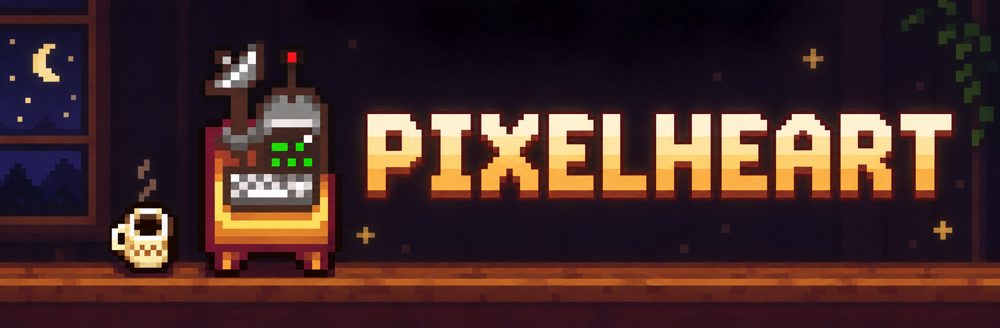

# Pixelheart

Make a new friend for Stardew Valley. Pixelheart is a free, fan-made character studio: give your villager a name, a voice, a daily routine, favorite gifts, heart events, portraits and a home, then put them in your game and go say hello. No coding needed.



> [!NOTE]
> Pixelheart is an early fan project. Characters you make play through SMAPI and Content Patcher, and every character still deserves a test run in your own game before you share it.

## What you need

- **Stardew Valley 1.6** on your computer (Steam or GOG, on Windows, macOS or Linux). Pixelheart reads your copy of the game to show real maps, portraits and menus. Nothing from the game is copied into Pixelheart or your character projects.
- **SMAPI** and **Content Patcher** to *play* your character. You can create without them; Pixelheart tells you when they're missing. Get them at [smapi.io](https://smapi.io/) and [Nexus Mods](https://www.nexusmods.com/stardewvalley/mods/1915).

## Start Pixelheart

There's no installer yet, so Pixelheart runs from this folder with [uv](https://docs.astral.sh/uv/getting-started/installation/) (version 0.12.16 or newer). Install uv once, then open a terminal in this folder and run:

```sh
uv sync --locked
uv run --locked python -m pixelheart
```

uv downloads the right Python and everything else Pixelheart needs.

## Your first visit

1. **Pixelheart finds your game.** It checks the usual Steam and GOG places, including Steam libraries on external drives. The welcome screen says what it found, for example *Stardew Valley 1.6.15 found on Just for Fun*, and whether SMAPI and Content Patcher are installed. If it can't find the game, choose **Find Stardew Valley…** and point it at the game folder. If your game lives on a drive that's unplugged, Pixelheart waits patiently and draws its own hearts and headings until you plug it back in.
2. **Choose New character** and type a name. That's it: Pixelheart saves them in `Documents/Pixelheart/<their name>/` for you.
3. **Follow the hearts.** The **Overview** page shows your character's journey as eight hearts, one per step, with a *Next up* suggestion and anything that still needs fixing.

Pixelheart keeps to warm white and black pixel lines, so the portraits, sprites and rooms you make carry the color. The hearts and heading lettering come from your installed game. Long writing sessions are easier on the eyes with **View → Easier-to-read text**, which keeps the pixel frames but uses a plain font.

## The eight steps

| Step | What you do there |
| --- | --- |
| **About them** | Name, birthday, personality, where they live, and whether they're open to romance |
| **Conversations** | What they say day to day, how they react to your story, and married life |
| **Daily routine** | Where they go each day, and how that changes with seasons, weather and marriage |
| **Gifts** | The gifts they love, like, dislike and hate, picked from the game's items |
| **Heart events** | The scenes at 2, 4, 6, 8, 10 and 14 hearts, staged on real maps from your game |
| **Portraits & sprites** | Their portrait expressions, walking sprites, and seasonal outfits |
| **Home** *(optional)* | Their home before marriage and their spouse room after |
| **Play in Stardew** | Check everything, put them in your game, and keep playtest notes |

Each finished step earns a heart in the sidebar and on the Overview.

## Start from a villager

Stuck on a blank page? Borrow a starting point from any villager in your game:

- **Conversations → Load dialogue template…** loads everything a villager says, like Haley's or Harvey's lines, so you can rewrite it in your character's voice.
- **Portraits & sprites → From my game…** shows a villager's portraits and walking sprites as a reference, or as starting artwork to paint over.

These read straight from your installed game. There are no console commands and no files to copy. (Want to start from a *modded* villager instead? Both windows have an **Advanced** option for Content Patcher exports.)

Pixelheart has no built-in AI artwork generation. If you want to use AI image tools, use them outside Pixelheart and import the finished PNG like any other artwork. Use art you made or have permission to use; see the [artwork guide](ARTWORK.md) for the sheet layouts.

## Play in Stardew

1. Open **Play in Stardew → Check & export**, fix anything it lists, and choose **Export for Stardew…**.
2. Open **Put in game & playtest** and install. Pixelheart suggests your game's Mods folder and only ever replaces its own earlier copy of this character; your other mods are left alone.
3. Start Stardew Valley through SMAPI, meet your character, and tick off the playtest checklist.

Only heart events marked ready go into the game. Unfinished drafts stay safely in your project.

## Keeping your characters safe

- Characters live in `Documents/Pixelheart/`. Back up that folder to keep everything, including imported artwork and homes.
- **File → Save a copy…** saves a character somewhere else.
- **Edit → Undo / Redo** works across the whole character, including Home.
- Keep a character's internal name the same once you've used them in a save file.

## Guides

[Artwork](ARTWORK.md) · [Heart events](STORY_WORKSHOP.md) · [Daily life](LIFE_AND_BRANCHING.md) · [Home](WORLD_BUILDING.md) · [Maps](MAP_WORKSHOP.md) · [Gift items](GAME_ITEMS.md) · [Export details](EXPORT_FORMAT.md)

## License

Free for personal, noncommercial modding under the [Pixelheart Source-Available License 1.1](LICENSE). Source available, not open source. The bundled Pixelify Sans font is under the SIL Open Font License (see `pixelheart/resources/fonts/OFL.txt`).

Stardew Valley is by **ConcernedApe**. Pixelheart is an unofficial fan tool, unaffiliated with and unendorsed by ConcernedApe.
